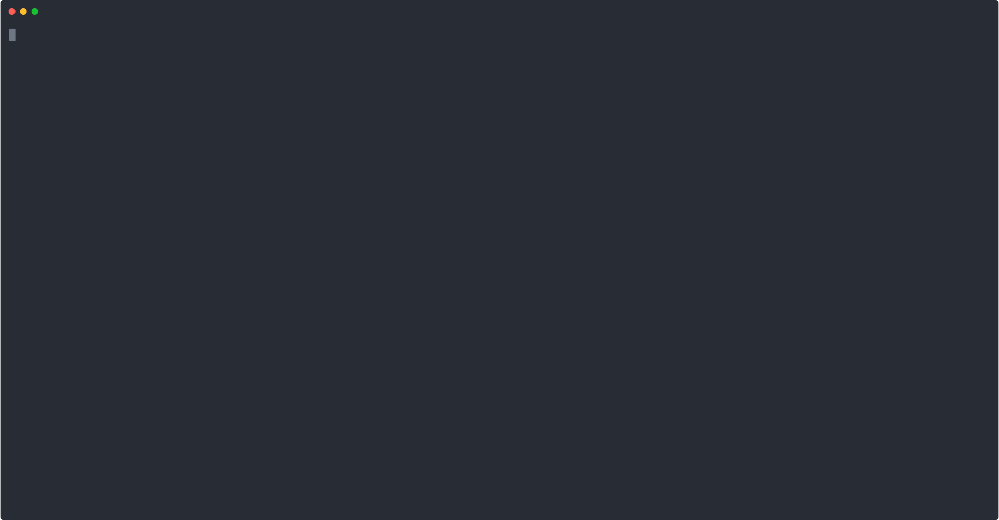

# b2w-game-app-backend-quarkus

B2W Game (quarkus)

"Fast and furious" keeper, all-in-one, simple (though hard to scale)

See app dir for sources. Uses quarkus, resteasy, mongodb

## Running the app in dev mode

```
mvn quarkus:dev
```

## Package 

```
mvn clean package
```

Produces the `b2w-game-app-backend-quarkus-1.0.0-runner.jar` file in the `/target` directory.
(it’s not an _über-jar_ as the dependencies are copied into the `target/lib` directory)

## How to run with Java

Usual exec: `java -jar target/b2w-game-app-backend-quarkus-1.0.0-runner.jar`.

## How to create a native executable

No java to run (but GraalVM/Mandrel needed to build)

Create a native executable: `mvn clean package -Pnative -Dmaven.test.test.skip=true`

Execute natively: `./target/b2w-game-app-backend-quarkus-1.0.0-runner`

## Run



